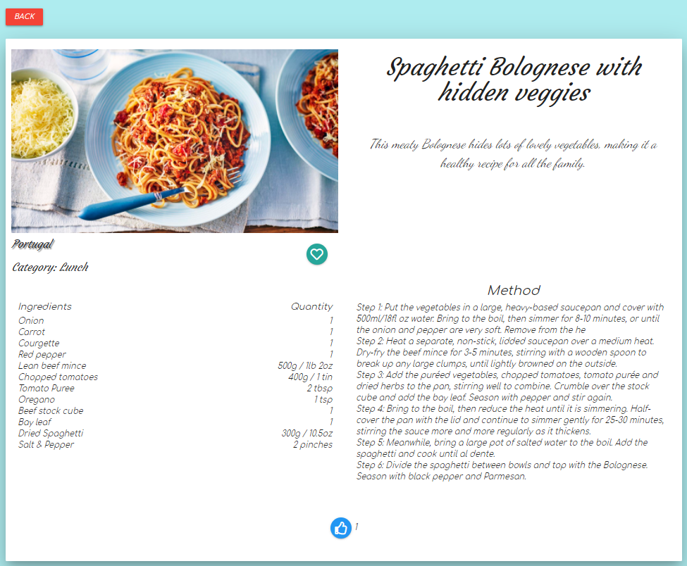

[World Recipes](https://world-recipes-pg.herokuapp.com/)

## Contents ##
---

* UX
    * [Introduction](#introduction)
    * [User Stories](#user-stories)
    * [Design](#design)
        * [Wireframe](#design)
        * [Database](#design)
        * [Fonts](#fonts)
        * [Icons](#icons)
        * [Colours](#colours)

* [Features](#features)
    * [Features that have been developed](#developed)
* [Technologies](#technologies)
* [Testing](#testing)
* [Deployment](#deployment)
* [Credit](#credits)

## Introduction ##

World Recipes has been created for people to discover and share recipes from around the world and offers users the ability to save favourite recipes

## UX (User Experience) ##
---

### User Stories ### 

As a user I would like:

* To be able to view recipes without having to create an account
* To be able to see popular recipes that other users have liked
* To have the option of saving favourite recipes
* To have the option to remove favourite recipes
* To have the option to share recipes
* To have the option to edit shared recipes
* To be able to change my password

In addition to these options, as the admin user I would like:

* To be able to Edit search categories
* To be able to Edit all recipes

## Design  ##
---

### Wireframes ###

The webite was initially designed using [balsamiq](https://balsamiq.com/) to create wireframes representing the site structure. See link below for details

* [Desktop](documents/wireframes/desktop.md)
* [Tablet](documents/wireframes/tablet.md)
* [Mobile](documents/wireframes/mobile.md)

### Database ###
I used [dbdiagram.io](https://dbdiagram.io/d) to design the database structure and relations ships

### **Fonts** ###

In order to create the feeling of handwritten recipe cards I chose the following fonts from Google fonts.

##### Logo and Recipe descriptions #####
* Dancing Script cursive
##### Titles #####
* Courgette cursive

##### Buttons and other where clairity is required #####
* Comfortaa cursive, Style: Italic

### **Icons** ###

The following sites were used for icon creation

* [Font Awesome](https://fontawesome.com/)
* [Favicon.io](https://favicon.io/).
* [Materialize CSS](https://materializecss.com/)

### **Colours** ###

For the majority of colours the below colour panel was used to represent different colours of the world (land, sky and sea)

* 
    * like hover
* 
    * Header & Footer
* 
    * Submit Buttons
* 
    * button effects
* 
    * Background

## Features ## 
---

**Navigation bar**

* Not signed in Nav Bar

* Not signed in Nav Bar Mobile

* Standard User Nav Bar

* Standard User Nav Bar Mobile

* admin User Nav Bar

* admin User Nav Bar Mobile

**Footer**

* Social media links

**Home Page**

* Popular Recipes Carousel

* Blue like button showing number of likes and indicating current user has liked the recipe

**Recipe Details Page**

* Recipe showing:    
    * Reicpe Name
    * Category
    * Country of origin
    * Description
    * Ingredients 
    * Method steps 
    * Likes 
    * Favourite button

**Recipes Page**

* Recipe card showing:
    * Recipe name
    * description
    * added by
    * likes* favourite
    * Country of origin

* Search bar showing fields for:
    * Country
    * Category
    * Vegetarian yes/no
    * Keyword search

**Manage Recipes & My Recipes Page**

* Edit & Delete Recipe buttons

**Manage Categories Page**

* Manage Categories cards with Edit and Delete options

**Favourite Recipes Page**

* Remove favourite button

**Add Recipe Page**

* Remove Ingredient & Remove step Buttons after click add 

&nbsp;
### **Defensive Programming** ###

* Sign out confirm modal 

* Delete Recipe confirm modal 

* Delete Category confirm modal 

**Change Password**

* Incorrect old password entered

* New and confirm passwords don't match

**Sign In**

* Incorrect username or password entered

**Register**

* Incorrect confirm password entered

## Technologies, libraries and tools used ##

**Front-End**
* [Bootstrap](https://bootstrap4.com/)
* [CSS](https://developer.mozilla.org/en-US/docs/Web/CSS)
* [Font-Awesome](https://fontawesome.com/)
* [Google fonts](https://fonts.google.com/)

* [HTML](https://developer.mozilla.org/en-US/docs/Web/HTML)
* [Javascript](https://www.javascript.com/)

* [materializecss](https://materializecss.com/)
* [favicon.io](https://materializecss.com/)

**Back-end**
* [Flask](https://flask.palletsprojects.com/en/1.1.x/)
* [Jinja](https://jinja.palletsprojects.com/en/2.11.x/)
* [MongoDB](https://www.mongodb.com/1)
* [Python](https://www.python.org/)
* [Werkzeug](https://werkzeug.palletsprojects.com/en/1.0.x/)

**Deployment**
* [Heroku](https://dashboard.heroku.com/)
* [Git](https://git-scm.com/)
* [Github](https://github.com/)
* [Gitpod](https://gitpod.io/)
* [dbdiagram.io](https://dbdiagram.io/d)

## Testing ##
---

Details of all tests that were performed can be found [here](documents/testing.md)

In order to test this site as admin you will need the following credentials:
* Username: admin
* Password: Password1

### Issues identified and fixed ###

* Incorrect Recipes deleting & Removing from Favourites
    * Issue was caused by a modal generation in for loop taking the same ID for every modal. Fixed by appending {{ loop.index }} to modal id
* Change Password modal trying to flash messages to deleted my account page
    * Fixed by changing modal to a Change password page where flash message can be displayed until password is successfully changed and then redirect to Home page

In addition to the tests that were completed in the testing document, all code has been tested using the following code validators.

* [JSHint](https://jshint.com/) (JS file passed validator)
* [PEP8 online](http://pep8online.com/)
* [W3C HTML Validator](https://validator.w3.org/) (all pages passed validator)
* [W3C CSS Validator](https://jigsaw.w3.org/css-validator/) (css file passed validator)

#### User Story verification ####

Does this site provide the following user features?

* To be able to view recipes without having to create an account
    * Yes
* To be able to see popular recipes that other users have liked
    * Yes
* To have the option of saving favourite recipes
    * Yes
* To have the option to remove favourite recipes
    * Yes
* To have the option to share recipes
    * Yes
* To have the option to edit shared recipes
    * Yes
* To be able to change my password
    * Yes

As admin user:

* To be able to Edit search categories
    * Yes
* To be able to Edit all recipes
    * Yes

## Deployment ##
---

### Local Deployment ###

* Open browser of choice.
* Copy/Paste the address of [World Recipes](https://github.com/phil-griffith/world_recipes) in your search box.
* When on the page, click on the "Code" button.
* Copy the the [HTTPS Link](https://github.com/phil-griffith/world_recipes).
* Open your IDE and in your terminal, create a virtual environement supporting python and flask and activate it.
* Type "git clone" and paste the [HTTPS Link](https://github.com/phil-griffith/world_recipes).
* Create an environement file called "env.py" and add :
    - MONGO_URI=mongodb+srv://...
    - SECRET_KEY= [Your Secret key]
* Add your env.py to .gitignore. to avoid it being uploaded.
* In app.py, switch **debug=False** to **debug=True**
* Upgrade pip locally with the command "pip install -U pip".
* Install the modules used to run the application using "pip freeze > requirements.txt" in your terminal.
* Create a MongoDB account and create a database called **"world_recipes"**.
* Add documtents to database collection as per [database design](#database)

* You can now run your application locally by typing the command "python3 app.py" or "run app.py" in your terminal.
* You can visit the website at http://127.0.0.1:5000

## Deploying on Heroku

- Create a requirements.txt file using the command **pip3 freeze --local > requirements.txt** in your CLI.
- Create a Procfile (always with an uppercase P) through the command **echo web: python app.py > Procfile**. Commit and Push.
- Create an account on [**Heroku**](https://www.heroku.com/home).
- Create a new app with **unique name**.
- Select your **nearest region**.
- Create a **new python project** within the project.
- Link that project through your **Github repository** in the **deployment** section.
- Navigate to Haroku Settings and set up the following in **Config Vars**

* Go back to the Deploy section, select the master branch and deploy the project. 

## Credits ##
---

* Recipes
    * https://www.bbcgoodfood.com/recipes/sausages-winter-veg-mash
    * https://www.bbc.co.uk/food/recipes/spaghetti_bolognese_with_23409
    * https://www.bbc.co.uk/food/recipes/hawaiian_pizza_48114
    * https://www.japancentre.com/en/recipes/1141-datemaki

* Home page images
    * https://www.pnas.org/content/116/37/18152.full
    * https://www.kcrw.com/culture/shows/good-food/sonoran-tortillas-korean-home-cooking-jet-ali-tila/making-korean-meals-at-home-is-easier-than-you-think-says-sohui-kim

I would also like to thank my Mentor Aaron Sinnot for all of his advice and my family and friends for testing the site for me
