[< Back to README.md](../README.md)

# Testing #

The following tests have been completed during the development of this site.

### Home Page ###
---

#### Navigation Bar ####

##### Nav Bar links (Not signed in ) #####
* Click Recipes
  * Expect: Recipes page to load
* Click Sign / Register
  * Expect: Sign in page to load

##### Mobile SideNav Bar links (Not signed in ) #####

* Click Recipes
  * Expect: Recipes page to load
* Click Sign / Register
  * Expect: Sign in page to load

##### Nav Bar links (Signed in ) #####
* Click Recipes
  * Expect: Recipes page to load
* Click Sign / Register
  * Expect: Sign in page to load
* Click Add Recipe
  * Expect: Add Recipe page to load
* Click My Account
  * Expect: My Account dropdown to display
    * Click Favourite Recipes
      * Expect: Favourite Recipes page to load
    * Click My Recipes
      * Expect: My Recipes page to load
    * Click Change Password
      * Expect: Change Password modal to load
* Click Sign Out
  * Expect: modal popup asking for confirmation
    * Click No
      * Expect: modal to close
    * Click Yes
      * Expect: Sign In page to load with a flash message saying Goodbye

##### Mobile SideNav Bar links (Signed in ) #####
* Click Recipes
  * Expect: Recipes page to load
* Click Sign / Register
  * Expect: Sign in page to load
* Click Add Recipe
  * Expect: Add Recipe page to load
* Click My Account
  * Expect: My Account dropdown to display
    * Click Favourite Recipes
      * Expect: Favourite Recipes page to load
    * Click My Recipes
      * Expect: My Recipes page to load
    * Click Change Password
      * Expect: Change Password modal to load
* Click Sign Out
  * Expect: modal popup asking for confirmation
    * Click No
      * Expect: modal to close
    * Click Yes
      * Expect: Sign In page to load with a flash message saying Goodbye

##### Nav Bar links (Signed in as admin) #####
* Click Recipes
  * Expect: Recipes page to load
* Click Sign / Register
  * Expect: Sign in page to load
* Click Add Recipe
  * Expect: Add Recipe page to load
* Click Manage Recipes
  * Expect: Manage Recipes page to load
* Click Manage Search Categories
  * Expect: Manage Search Categories page to load
* Click My Account
  * Expect: My Account dropdown to display
    * Click Favourite Recipes
      * Expect: Favourite Recipes page to load
    * Click My Recipes
      * Expect: My Recipes page to load
    * Click Change Password
      * Expect: Change Password modal to load
* Click Sign Out
  * Expect: modal popup asking for confirmation
    * Click No
      * Expect: modal to close
    * Click Yes
      * Expect: Sign In page to load with a flash message saying Goodbye

##### Mobile Side Nav Bar links (Signed in as admin) #####
* Click Recipes
  * Expect: Recipes page to load
* Click Sign / Register
  * Expect: Sign in page to load
* Click Add Recipe
  * Expect: Add Recipe page to load
* Click Manage Recipes
  * Expect: Manage Recipes page to load
* Click Manage Search Categories
  * Expect: Manage Search Categories page to load
* Click My Account
  * Expect: My Account dropdown to display
    * Click Favourite Recipes
      * Expect: Favourite Recipes page to load
    * Click My Recipes
      * Expect: My Recipes page to load
    * Click Change Password
      * Expect: Change Password modal to load
* Click Sign Out
  * Expect: modal popup asking for confirmation
    * Click No
      * Expect: modal to close
    * Click Yes
      * Expect: Sign In page to load with a flash message saying Goodbye

#### Polular Recipes Section ####

##### Recipe cards Like Button (Not signed in) #####
* Expect number to match recipe likes in the database
* On Click
  * Expect: modal popup requesting user to sign in or register
    * Click close
      * Expect modal to close
    * Click Sign in / Register
     * Expect Sign in page to load

##### Recipe cards Like Button (Signed in) #####
* Expect number to match recipe likes in the database
* Expect any recipes that current user has already liked to be coloured blue
* On Click
  * If icon is blue & user has already liked recipe - Expect: Nothing
  * If icon is green and user has not liked recipe - Expect: Icon to turn blue, number to increment by one and database to update

##### Recipe cards See Recipe button (Not signed in) #####
* on Click
  * Expect: Recipe Details page to load

##### Recipe cards See Recipe button (Signed in) #####
* on Click
  * Expect: Recipe Details page to load

##### Call to action section (Not signed in) #####

* Expect message displaying "Register or sign in to add your own recipe & save your favourites"
* Expect button to display "Start Sharing"
* Click Start Sharing
  * Expect: Sign in page to load

##### Call to action section (Signed in) #####

* Expect message displaying "Register or sign in to add your own recipe & save your favourites" to not be visible
* Expect button to display "Share Recipe"
* Click Share Recipe
  * Expect: Add Recipe page to load

#### Footer ####

* Click Facebook logo
    * Expect: Facebook homepage to load
* Click Twitter logo
    * Expect: Twitter homepage to load
* Click Instagram logo
    * Expect: Instagram homepage to load

### Recipe Page ###
---

#### Search Bar ####

* Click All Countries dropdown
    * Expect: List of countries to display
        * Select Country
            * Expect: Country to display in search field
                * Click Search 
                    * Expect: All Recipes with a Country of Origin matching the selected Country to be displayed
                    * If no matching recipes are found - Expect: Message displaying "No results found"
                * Click Reset
                    * Expect: Country seletion and "No results found" to clear and all Recipes to load
* Click Category dropdown
    * Expect: List of Categories to display
        * Select Category
            * Expect: Category to display in search field
                * Click Search 
                    * Expect: All Recipes with a category matching the selected Category to be displayed
                    * If no matching recipes are found - Expect: Message displaying "No results found"
                * Click Reset
                    * Expect: Category seletion and "No results found" to clear and all Recipes to load
* Tick Vegetarian checkbox
    * Click Search 
        * Expect: All Vegetarian Recipes to be displayed
        * If no matching recipes are found - Expect: Message displaying "No results found"
            * Click Reset
                * Expect: Vegetarian checkbox and "No results found" to clear and all Recipes to load
* Enter a keyword into the Search Recipes field
    * Click Search 
        * Expect: All Recipes containing the keyword to be displayed
        * If no matching recipes are found - Expect: Message displaying "No results found"
            * Click Reset
                * Expect: Search Recipes field and "No results found" to clear and all Recipes to load
* Select Country and Category
    * Expect Recipes matching both search terms to be displayed
    * If no matching recipes are found - Expect: Message displaying "No results found"
        * Click Reset
            * Expect: Country field, Category field and "No results found" to clear and all Recipes to load
* Select Country and Vegetarian
    * Expect Recipes matching both search terms to be displayed
    * If no matching recipes are found - Expect: Message displaying "No results found"
        * Click Reset
            * Expect: Country field, vegetarian field and "No results found" to clear and all Recipes to load
* Select Country and enter keyword in Search Recipe field
    * Expect Recipes matching both search terms to be displayed
    * If no matching recipes are found - Expect: Message displaying "No results found"
        * Click Reset
            * Expect: Country field, Search Recipes field and "No results found" to clear and all Recipes to load
* Select Country, Category, Vegetarian and enter keyword in Search Recipe field
    * Expect Recipes matching all search terms to be displayed
    * If no matching recipes are found - Expect: Message displaying "No results found"
        * Click Reset
            * Expect: Country field, Category field, vegetarian field, Search Recipes field and "No results found" to clear and all Recipes to load

#### Recipe Cards (Not signed in) ####

* Expect: All favourite icons to be green
* Expect: All like icons to be green and to have a number that matches the number of recipe likes in the database
* Click favourite icon
    * Expect: modal pop up asking user to Sign in or Register
        * Click close
            * Expect: modal to close
        * Click Sign in / Register
            * Expect: Sign in page to load
* Click like icon
    * Expect: modal pop up asking user to Sign in or Register
        * Click close
            * Expect: modal to close
        * Click Sign in / Register
            * Expect: Sign in page to load
* Click See Recipe
    * Expect: Recipe Details page to load

#### Recipe Cards (Signed in) ####

* Expect: All favourite icons on Recipes that the current user has added to favourites to be red and the rest to be green
* Expect: All like icons on Recipes that the current user has liked to be blue and the rest to be green, and to have a number that matches the number of recipe likes in the database
* Click favourite icon
    * If Recipe has not already been added to favourites - Expect:favourite icon to turn red and for recipe to be added to users favourite recipes page
    * If Recipe has already been added to favourites - Expect: Nothing
* Click like icon
    * If Recipe has not already been liked by user Expect: like icon to turn blue, number to increment by one and database to be updated
    * If Recipe has already been liked by user - Expect: Nothing
* Click See Recipe
    * Expect: Recipe Details page to load

### Recipe Details Page (Not Signed In) ###
---

* Expect: favourite icon to be green
* Expect: like icon to be green and to have a number that matches the number of recipe likes in the database
* Click favourite icon
    * Expect: modal pop up asking user to Sign in or Register
        * Click close
            * Expect: modal to close
        * Click Sign in / Register
            * Expect: Sign in page to load
* Click like icon
    * Expect: modal pop up asking user to Sign in or Register
        * Click close
            * Expect: modal to close
        * Click Sign in / Register
            * Expect: Sign in page to load

#### Back button ####
* From Home page - Click See Recipe on any recipe
    * From Recipe Details page- Click Back
        * Expect: Home page to load
* From Recipes page - Click See Recipe on any recipe
    * From Recipe Details page- Click Back
        * Expect: Recipes page to load
* From Recipe Search Results page - Click See Recipe on any recipe
    * From Recipe Details page- Click Back
        * Expect: Recipe Search Results to load

### Recipe Details Page (Signed In) ###
---

* Expect: Favourite icon to be red if user has added to favourites or green if not added
* Expect: Like icon to be showing number of likes and blue if user has liked recipe or green if not
* Click favourite icon
    * If Recipe has not already been added to favourites - Expect:favourite icon to turn red and for recipe to be added to users favourite recipes page
    * If Recipe has already been added to favourites - Expect: Nothing
* Click like icon
    * If Recipe has not already been liked by user Expect: like icon to turn blue, number to increment by one and database to be updated
    * If Recipe has already been liked by user - Expect: Nothing

#### Back button ####
* From Home page - Click See Recipe on any recipe
    * From Recipe Details page- Click Back
        * Expect: Home page to load
* From Recipes page - Click See Recipe on any recipe
    * From Recipe Details page- Click Back
        * Expect: Recipes page to load
* From Recipe Search Results page - Click See Recipe on any recipe
    * From Recipe Details page- Click Back
        * Expect: Recipe Search Results to load
* From Favourite Recipes page - Click See Recipe on any recipe
    * From Recipe Details page- Click Back
        * Expect: Favourite Recipes page to load
* From My Recipes page - Click See Recipe on any recipe
    * From Recipe Details page- Click Back
        * Expect: My Recipes page to load
* From Manage Recipes page - Click See Recipe on any recipe
    * From Recipe Details page- Click Back
        * Expect: Manage Recipes page to load

### Sign In Page ###
---

* Click Sign In
    * Expect: Prompt to complete Username field and red underline
* Enter a username and Click Sign In
    * Expect: Prompt to complete password field and red underline
* Enter a password and Click Sign In
    * If username and password are valid - Expect: Home page to load with a flash message displaying "Welcome, [username]"
    * If username is invalid - Expect: flash message displaying "Incorrect Username and/or Password"
    * If password is invalid - Expect: flash message displaying "Incorrect Username and/or Password"
    * If both username and password are invalid - Expect: flash message displaying "Incorrect Username and/or Password"
* Click Register
    * Expect: Register page to load

### Register Page ###
---
* Click Register
    * Expect: Prompt to complete username field
* Enter a username with less than 5 characters and Click Register
    * Expect: Prompt to match the username format requested and red underline
* Enter a username with more than 15 characters and Click Register
    * Expect: Prompt to match the username format requested and red underline
* Enter a username with more than 5 characters and less then 15 characters and Click Register
    * Expect: Prompt to complete password field and green underline for username
* Enter a password with less than 8 non special characters, containing at least 1 number and 1 capital letter and Click Register
    * Expect: Prompt to match the password format requested and red underline
* Enter a password with more than 8 non special characters containing all lowercase letters and 1 number and Click Register
    * Expect: Prompt to match the password format requested and red underline
* Enter a password with more than 8 non special characters containing all capital letters and 1 number and Click Register
    * Expect: Prompt to match the password format requested and red underline
* Enter a password with more than 8 non special characters containing at least 1 capital letter and no numbers and Click Register
    * Expect: Prompt to match the password format requested and red underline
* Enter a password with more than 8 non special characters containing at least 1 capital letter and 1 number and Click Register
    * Expect: Prompt to complete the confirm password field and green underline for password field
* Enter a confirm password that does not match the password entered and Click Register
    * Expect: Message under Confirm Password field saying "Passwords do not match and red underline
* Enter a confirm password that matches the password entered and Click Register
    * Expect: Prompt to complete Email field
* Enter an email address without the @ symbol
    * Expect: Prompt to use the @ symbol in the email address and a red underline
* Enter a valid email address and Click Register
    * Expect: Prompt to complete Country of Residence field
* Select a country from the drop down and Click Register
    * Expect: 
        * Home page to load with flash message saying "Registration Successfull"
        * Sign In / Register button to be replaced with Sign out button
        * Add Recipe and My Account to appear on Nav Bar

### Add Recipe Page ###
---
* Click Cancel
    * Expect Previous page to load (Manage Recipes or My Recipes)
* Click Submit
    * Expect: Promt to complete Recipe Name field
* Enter Recipe Name and Click Submit
    * Expect: Promt to complete Recipe image URL field
* Enter Recipe image URL and Click Submit
    * Expect: Promt to complete Recipe Category field
* Select Category and Click Submit
    * Expect: Promt to complete Recipe Description field
* Enter description and Click Submit
    * Expect: Promt to complete Country field
* Click vegetarian toggle
    * Expect toggle to turn green and slide to the right
* Select Country and Click Submit
    * Expect: Promt to complete Ingredient field
* Enter ingredient and Click Submit
    * Expect: Promt to complete Quantity field
* Enter Quantity and Click Submit
    * Expect: Promt to complete step field
* Click Add Ingredient
    * Expect: Remove Ingredient button to appear
* Enter ingredient and Click Submit
    * Expect: Promt to complete Quantity field
* Enter Quantity and Click Submit
    * Expect: Promt to complete Step field
* Click Remove Ingredient
    * Expect: Remove Ingredient button and additional Ingredient and Quantity fields to disappear
* Click Add Step
    * Expect Remove step button and additional step field to appear
* Click Remove Step
    * Expect: Remove Step button and additional step field to disappear
* Enter Step with less than 5 characters and Click Submit
    * Expect: Promt to enter 5 or more charcters for the step
* Enter Step with more than 5 characters and Click Submit
    * Expect: Recipes page to load with a flash message saying Recipe Successfully added

### Favourite Recipes Page ###
---

* Expect: All favourtite recipes for user to be displayed or message displaying "You have not added any favourite recipes yet"
* Expect: All like icons on Recipes that the current user has liked to be blue and the rest to be green, and to have a number that matches the number of recipe likes in the database
* Click like icon
    * If Recipe has not already been liked by user Expect: like icon to turn blue, number to increment by one and database to be updated
    * If Recipe has already been liked by user - Expect: Nothing
* Click Remove icon
    * Expect: modal popup request confirmation
        * Click No
            * Expect: modal to close
        * Click Yes
            * Expect: Recipe to disappear and recipe id to be removed from user account in database
* Click See Recipe
    * Expect: Recipe Details page to load

### My Recipes Page ###
---

* Expect: All recipes created by user to be displayed or message displaying "You have not added any recipes yet"
* Expect: All like icons on Recipes that the current user has liked to be blue and the rest to be green, and to have a number that matches the number of recipe likes in the database
* Click like icon
    * If Recipe has not already been liked by user Expect: like icon to turn blue, number to increment by one and database to be updated
    * If Recipe has already been liked by user - Expect: Nothing
* Click Edit button
    * Expect: Edit Recipe page to load
* Click Delete button
    * Expect: modal popup requesting confirmation
        * Click No
            * Expect: modal to close
        * Click Yes
            * Expect: Recipe to disappear, document be removed from datebase, all user favourite links to be removed and a flash message displaying "Recipe Successully Deleted"
* Click See Recipe
    * Expect: Recipe Details page to load

### Edit Recipe Page ###
---

* Click Cancel
    * Expect Previous page to load (Manage Recipes or My Recipes)
* Click Submit
    * Expect Previous page to load (Manage Recipes or My Recipes) and flash message saying "Recipe Successfully Updated"
* EDIT Recipe Name and Click Submit
    * Previous page to load (Manage Recipes or My Recipes) and flash message saying "Recipe Successfully Updated"
* EDIT Recipe image URL and Click Submit
    * Expect: Previous page to load (Manage Recipes or My Recipes) and flash message saying "Recipe Successfully Updated"
* EDIT Category and Click Submit
    * Expect: Previous page to load (Manage Recipes or My Recipes) and flash message saying "Recipe Successfully Updated"
* EDIT description and Click Submit
    * Expect: Previous page to load (Manage Recipes or My Recipes) and flash message saying "Recipe Successfully Updated"
* Click vegetarian toggle
    * Expect toggle to change from green to grey or grey to green and slide to the right or left
* EDIT Country and Click Submit
    * Expect: Previous page to load (Manage Recipes or My Recipes) and flah message saying "Recipe Successfully Updated"
* EDIT ingredient and Click Submit
    * Expect: Previous page to load (Manage Recipes or My Recipes) and flah message saying "Recipe Successfully Updated"
* EDIT Quantity and Click Submit
    * Expect: Previous page to load (Manage Recipes or My Recipes) and flah message saying "Recipe Successfully Updated"
* Click Add Ingredient
    * Expect: Remove Ingredient button to appear
* Enter ingredient and Click Submit
    * Expect: Promt to complete Quantity field
* Enter Quantity and Click Submit
    * Expect: Previous page to load (Manage Recipes or My Recipes) and flah message saying "Recipe Successfully Updated"
* Click Remove Ingredient
    * Expect: Remove Ingredient button and additional Ingredient and Quantity fields to disappear
* Click Add Step
    * Expect Remove step button and additional step field to appear
* Click Remove Step
    * Expect: Remove Step button and additional step field to disappear

### Change Password Page ###
---
* Click Cancel
    * Expect: Home page to load
* Click Change Password
    * Expect: Prompt to complete old password field
* Enter wrong old password and Click Change Password
    * Expect: Prompt to complete new password field
* Enter new password and Click Change Password
    * Expect: Prompt to complete confirm new password field
* Enter confirm new password and Click Change Password
    * Expect: flash message saying "Incorrect old password" and form to Reset
* Enter correct old password and Click Change Password
    * Expect: Prompt to complete new password field
* Enter new password and Click Change Password
    * Expect: Prompt to complete confirm new password field
* Enter wrong confirm new password and Click Change Password
    * Expect: flash message saying "Passswords do not match"
* Enter correct old password, new password and confirm new password and Click Change Password
    * Expect: Home page to load and flash message saying "Password Successfully updated"

### Manage Recipes Page (admin only) ###
---

* Expect: All recipes created by admin to be displayed or message displaying "You have not added any recipes yet"
* Expect: All like icons on Recipes that admin has liked to be blue and the rest to be green, and to have a number that matches the number of recipe likes in the database
* Click like icon
    * If Recipe has not already been liked by admin Expect: like icon to turn blue, number to increment by one and database to be updated
    * If Recipe has already been liked by admin - Expect: Nothing
* Click Edit button
    * Expect: Edit Recipe page to load
* Click Delete button
    * Expect: modal popup requesting confirmation
        * Click No
            * Expect: modal to close
        * Click Yes
            * Expect: Recipe to disappear, document be removed from datebase, all user favourite links to be removed and a flash message displaying "Recipe Successully Deleted"
* Click See Recipe
    * Expect: Recipe Details page to load

### Manage Search Categories Page (admin only) ###
---

* Click Edit on any category
    * Expect: Edit category page to load
        * Click Cancel
            * Expect Manage Search Categories page to load
        * Edit category and Click Submit
            * Expect Manage Search Categories page to load showing updated category name
* Click Delete on any category
    * Expect: modal popup requesting confirmation
        * Click No
            * Expect: modal to close
        * Click Yes
            * Expect: Category to disappear

### User Story Testing ###
---
* <strong>To be able to view recipes without having to create an account</strong>
  * Click Recipes button on navbar whilst signed out

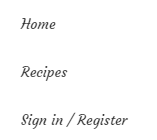

    * Expect Recipes page to load

    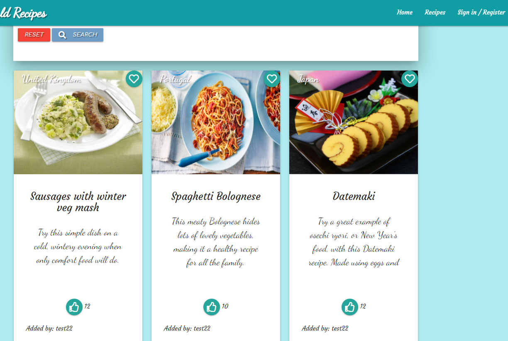
    &nbsp;
* <strong>To be able to see popular recipes that other users have liked</strong>
  * Identify 4 recipes with the highest amount of likes from the recipes page, and then click on the home page.
    * Expect the 4 recipes with the highest number of likes to appear on the Home screen Popular recipes section
    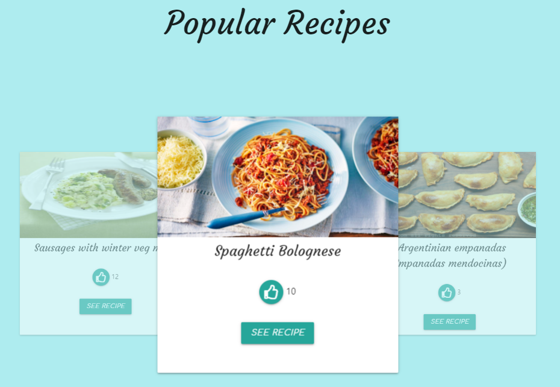
    &nbsp;
* <strong>To have the option of saving favourite recipes</strong>
  * After creating an account and signing in, choose a recipe and click the heart icon
    * Expect heart icon to turn red, recipe to appear in My Account > Favourite recipes and for favourite recipes to be saved after signing out.

    
    
    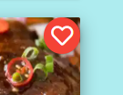
    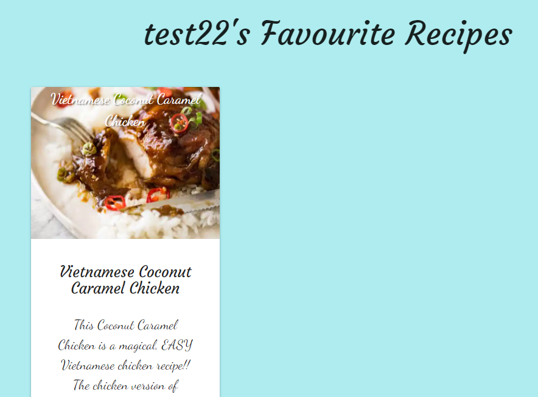
&nbsp;
* <strong>To have the option to remove favourite recipes</strong>
  * From Favourite recipes click on the red minus icon in the bottom right corner of the recipe to be removed.

    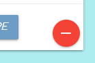

  
    * Expect modal asking for confirmation

    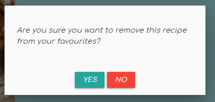

    * click Yes
        * Expect recipe to disappear, icon to go back to green on recipes page and flash message to display Recipe successfully Removed.

        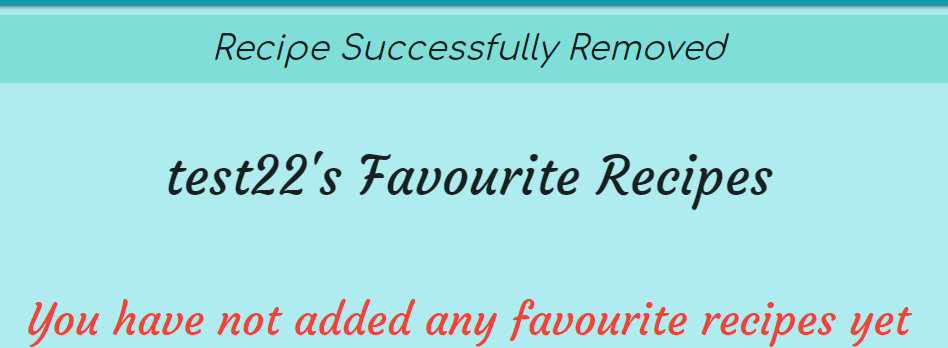        
        

    * click No
        * Expect modal to disappear

* <strong>To have the option to share recipes</strong>
  * After creating an account and signing in, click on the Add Recipe link on the Nav bar.

    
    * Expect Add recipe page to load

        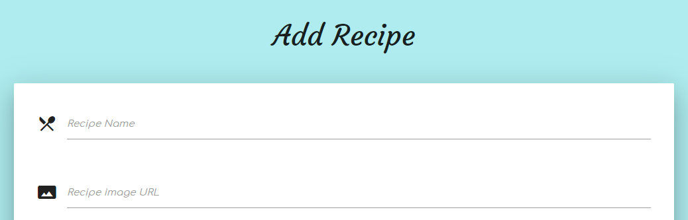

  * After creating an account and signing in, click on the Share Recipe button on the home page.

    
    * Expect Add recipe page to load

        

  * Complete Add recipe form and click submit
    * Expect recipe to appear on Recipe page

* <strong>To have the option to edit shared recipes</strong>
    * Sign in, Navigate to My Account > My Recipes and click Edit on Recipe to be edited.

        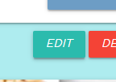
        * Expect Edit Recipe form to load, with pre-populated recipe information.

            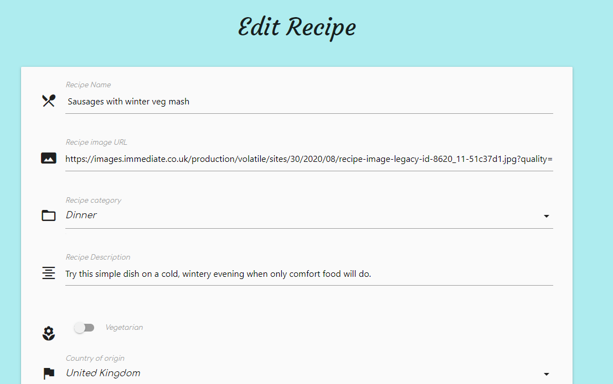
            * click Confirm changes

                
                * Expect recipe details to be updated

            * click Cancel
                * Expect any changes to be reverted back to original

* <strong>To be able to change my password</strong>
    * After creating an account and signing in Navigate to My Account > Change Password.

        
        * Expect Change password screen to appear

            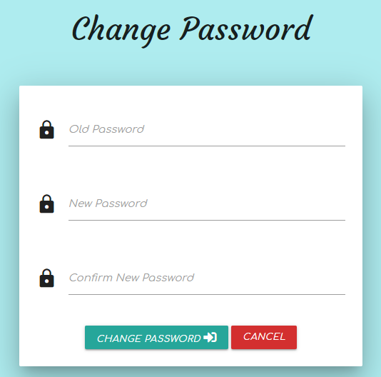

* <strong>As Admin - To be able to Edit search categories.</strong>
    * Sign in as admin user and click Manage Search Categories on the Nav bar.

        

        * Expect Manage Search Categories page to load

        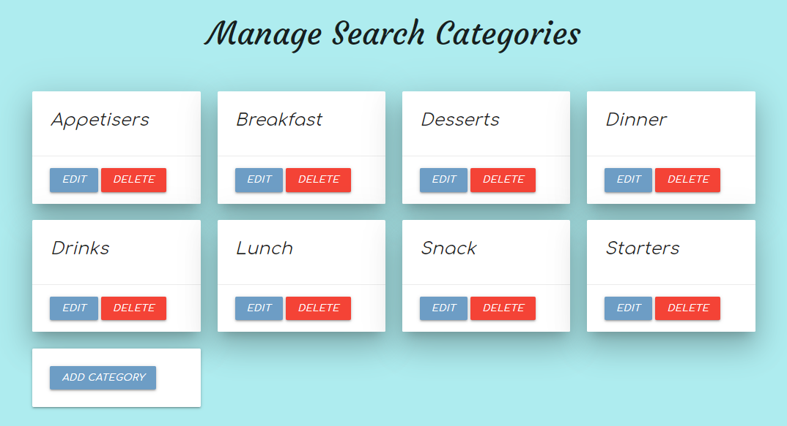

* <strong>As Admin - To be able to Edit all recipes</strong>
    * Sign in as admin user and click Manage Recipes on the Nav bar.

                
        * Expect Edit and Delete buttons to be visible for all recipes

            

### Security Features Testing ###
---

